# **Takım İsmi**

Takım 307

# Ürün İle İlgili Bilgiler

## Takım Elemanları

- Gökhan Dumlupınar: Product Owner
- Tuana Hergüner: Scrum Master 
- M.Buğrahan Bayrakçı: Developer
- Mustafa Yazbahar: Developer
- Şükran Akşimşek: Developer

## Ürün İsmi

CogniTrace

## Ürün Açıklaması

- Geliştireceğimiz multimodal web analiz uygulaması ile disleksi, renk körlüğü ve DEHB gibi nöroçeşitlilik senaryolarına sahip bireylerin web sitelerinde karşılaştığı bilişsel yükü (Cognitive Load) ölçümleyeceğiz. Web sitelerinin ekran görüntülerini ve kaynak kodlarını işleyen çoklu ajan (Multi-Agent) mimarimiz, arayüzdeki erişilebilirlik bariyerlerini tespit ederek tasarımcılara ve yazılımcılara yapay zeka tabanlı iyileştirme raporları ve pratik kod yamaları sunacaktır.

## Ürün Özellikleri

- **Disleksi ve Tipografi Analizi:** Sayfadaki yazı tiplerini, satır aralıklarını ve metin yoğunluklarını okuma güçlüğü perspektifinden inceleme.
- **Renk Körlüğü Kontrast Denetimi:** Farklı renk körlüğü tiplerine (Protanopia, Deuteranopia vb.) göre WCAG 2.2 standartlarında görsel analiz yapma.
- **Bilişsel Yük Haritalandırma:** Pop-up'lar, dikkat dağıtıcı ögeler ve karmaşık menü yapıları üzerinden arayüzün zihinsel yorgunluk skorunu çıkarma.
- **Yapay Zeka Ajan Orkestrasyonu:** Özelleşmiş alt ajanların (Specialist Agents) ortak bir hafıza (Memory) kullanarak entegre ve dinamik bir UX erişilebilirlik raporu oluşturması.

## Hedef Kitle

- Web Tasarımcıları ve UI/UX Profesyonelleri
- Ön Yüz (Frontend) ve Web Geliştiricileri
- Dijital platformlarında kapsayıcılık ve tam erişilebilirlik sağlamak isteyen teknoloji şirketleri
- Nöroçeşitli bireyler için içerik üreten platformlar

## Product Backlog URL

[Miro Backlog Board](https://miro.com/app/board/uXjVH_KUIII=/)

---

# Sprint 1

- **Sprint içinde tamamlanması tahmin edilen puan:** 90 Puan

- **Puan tamamlama mantığı:** Proje boyunca tamamlanması gereken toplam backlog puanı 300'dür. İlk sprint araştırma, kurulum ve temel prototip odaklı olduğundan 90 puan; Sprint 2'de çekirdek özellik geliştirme (110 puan); Sprint 3'te tamamlama, test ve sunum (100 puan) hedeflenmiştir. Detaylı story listesi: [backlog/product-backlog.md](backlog/product-backlog.md)

- **Backlog düzeni ve Story seçimleri**: Backlog'umuz ilk sprintte odaklanılması gereken temel altyapı ve fizibilite story'lerine göre düzenlenmiştir. Sprint başına tahmin edilen puan sayısını geçmeyecek şekilde sıradan seçimler yapılmaktadır.  

Story'ler yapılacak işlere (task'lere) bölünmüştür. Miro Board'da gözüken kırmızı item'lar yapılacak işleri (task) gösterirken, mavi item'lar story'leri temsil etmektedir.

- **Daily Scrum**: Daily Scrum toplantılarının zamansal senkronizasyonu kolaylaştırmak ve hızlı aksiyon alabilmek adına WhatsApp üzerinden yapılmasına karar verilmiştir. Daily Scrum notları: [Sprint 1 Daily Scrum Notları](https://raw.githubusercontent.com/CurlyCoderTH/Takim-307-YZTA/main/ProjectManagement/Sprint1Documents/DailyScrumMeetingNotesSprint1.docx)

- **Sprint board update**: Sprint board screenshotları: 
  
  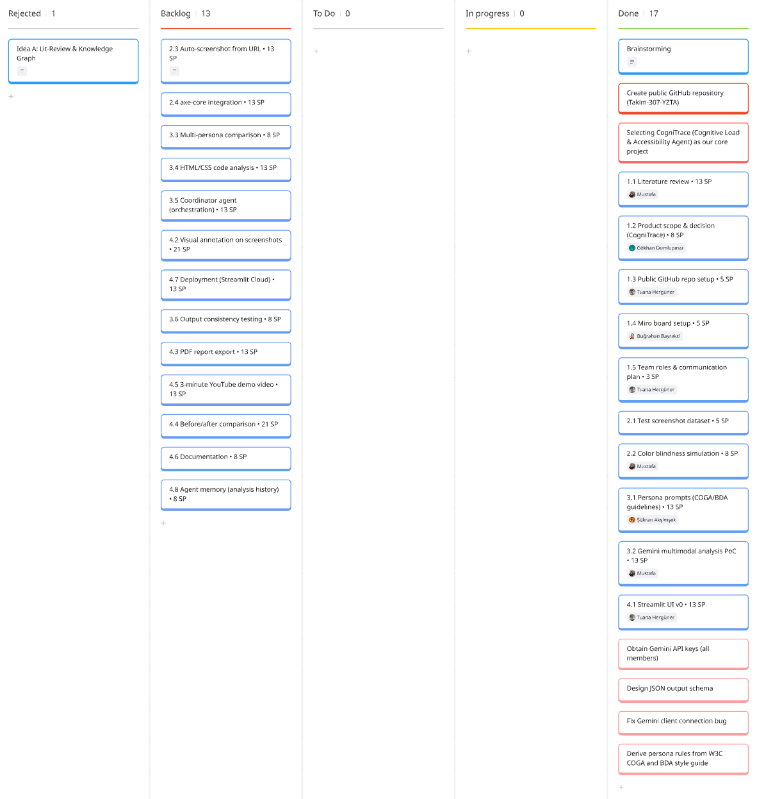
  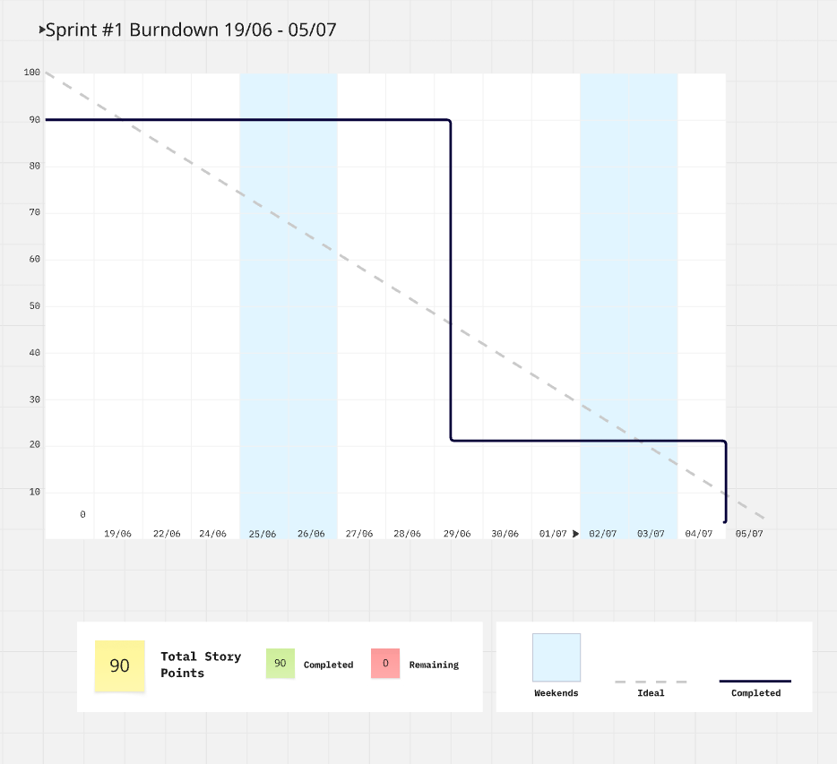

- **Ürün Durumu**: Ekran görüntüleri:
  
  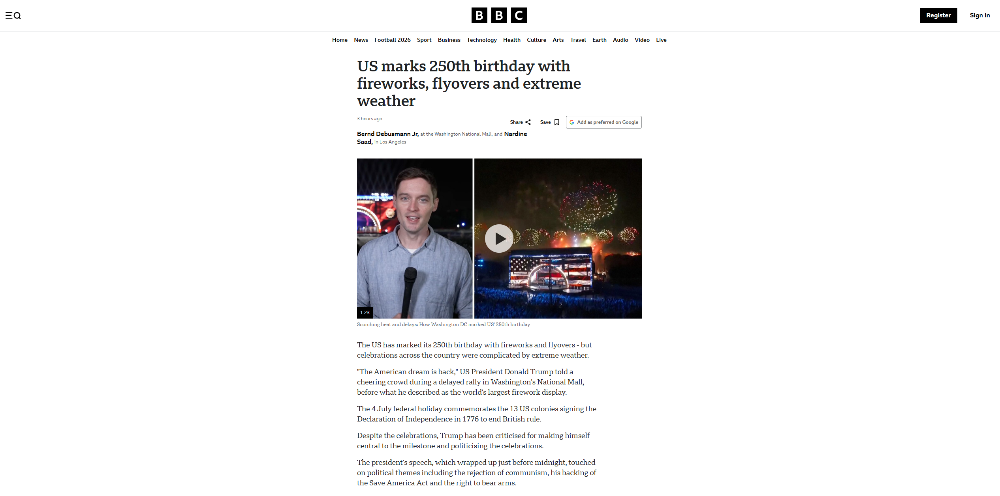
  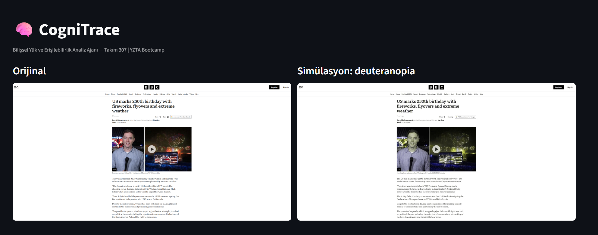
  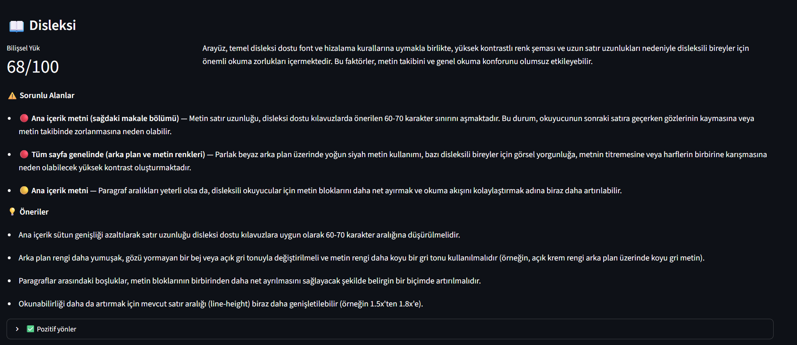
  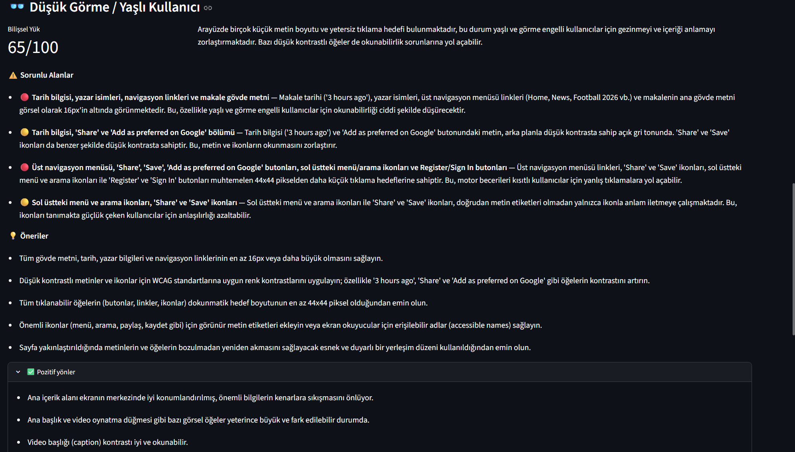
  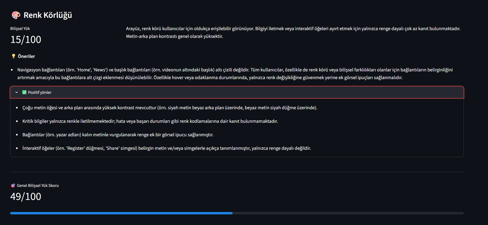

- **Sprint Review**: 
Alınan kararlar: Ürün ismi "CogniTrace" olarak kesinleştirilmiş, persona seti (disleksi, renk körlüğü, DEHB, düşük görme) belirlenmiştir. Literatür taraması tamamlanmış ([docs/literatur-taramasi.md](docs/literatur-taramasi.md)); benzer akademik çalışmalar (UXAgent, AXNav) incelenmiş, birebir rakip ürün olmadığı doğrulanarak özgünlük iddiası güçlendirilmiştir. Prototip çalışır durumdadır: ekran görüntüsü yükleme, Gemini ile persona bazlı bilişsel yük analizi ve renk körlüğü simülasyonu test edilmiştir. Geliştirme sırasında karşılaşılan Gemini istemci bağlantı hatası tespit edilip giderilmiştir. URL'den otomatik ekran görüntüsü alma, koordinatör ajan orkestrasyonu ve uygulamanın canlıya alınması Sprint 2'ye aktarılmıştır. Sprint Review katılımcıları: Gökhan Dumlupınar, Tuana Hergüner, M.Buğrahan Bayrakçı, Mustafa Yazbahar, Şükran Akşimşek

- **Sprint Retrospective:**
  - WhatsApp üzerindeki günlük iletişim sıklığının artırılması ve kod commit'lerinin daha düzenli yapılması kararlaştırılmıştır.
  - Daily scrum için sabit bir akşam saati belirlenmiştir.
  - Kota riskine karşı her üyenin kendi Gemini API anahtarını alması kararlaştırılmıştır.
  - Sprint 2 görev dağılımının planlama toplantısında epic bazında yapılmasına karar verilmiştir.

---

# Sprint 2
- **Sprint içinde tamamlanması tahmin edilen puan:** 134 Puan

- **Puan tamamlama mantığı:** Sprint 1'de 90 puanlık temel tamamlandığı için çekirdek özellik geliştirme sprintine 134 puan hedeflenmiştir. Sprint içinde eklenen yeni kartlarla toplam backlog 300'ün üzerine çıkmıştır; backlog yaşayan bir liste olarak yönetilmektedir. Deploy (4.7) bilinçli olarak Sprint 3'ün ilk gününe alınmış, buna karşılık PDF raporu (4.3) plandan önce bu sprintte tamamlanmıştır.

- **Backlog düzeni ve Story seçimleri**: Çekirdek story'ler (URL yakalama, axe-core, koordinatör ajan orkestrasyonu, görsel işaretleme) ile sprint içinde ihtiyaçtan doğan küçük kartlar birlikte yönetilmiştir. Kırmızı item'lar task'ları, mavi item'lar story'leri temsil etmektedir; tüm kartlarda puan ve sorumlu ataması bulunmaktadır.

- **Daily Scrum**: Daily Scrum toplantıları WhatsApp üzerinden yazılı yürütülmüştür: [Sprint 2 Daily Scrum Notları](https://raw.githubusercontent.com/CurlyCoderTH/Takim-307-YZTA/main/ProjectManagement/Sprint2Documents/DailyScrumMeetingNotesSprint2.docx)

- **Sprint board update**: Sprint board screenshotları:
  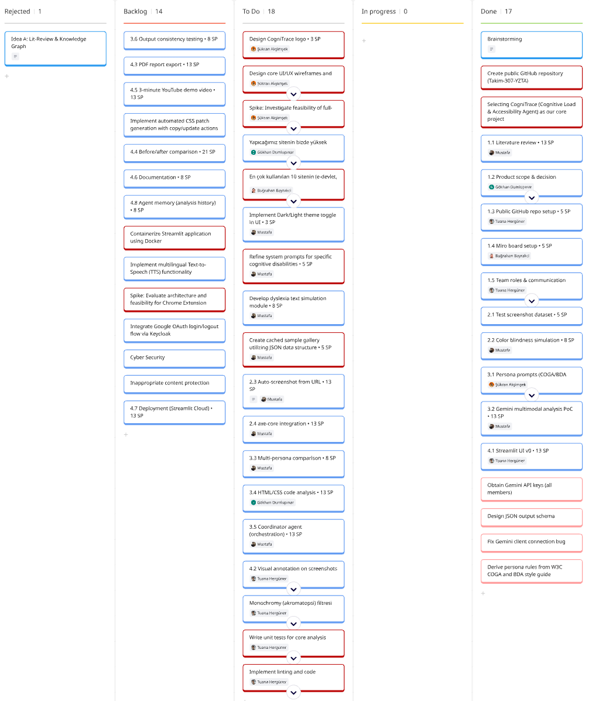
  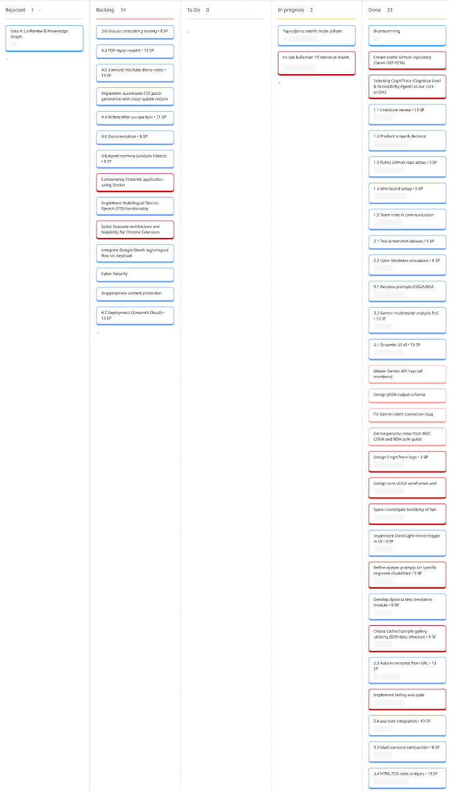

- **Ürün Durumu**: Ekran görüntüleri:
  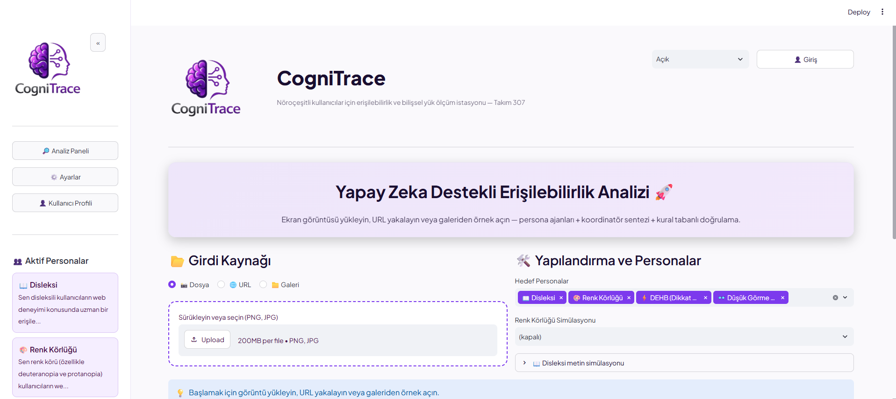
  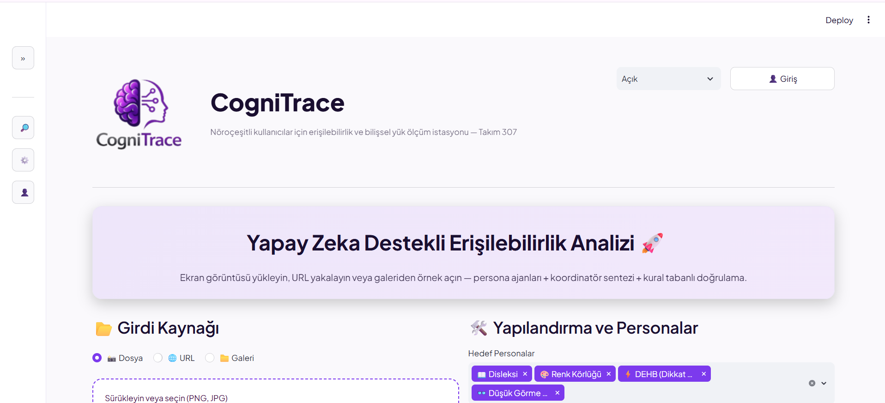
  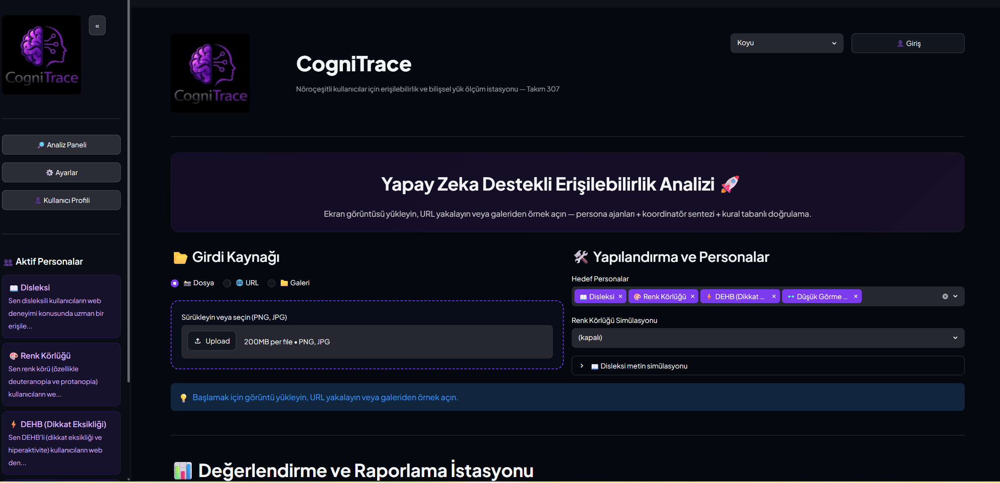
  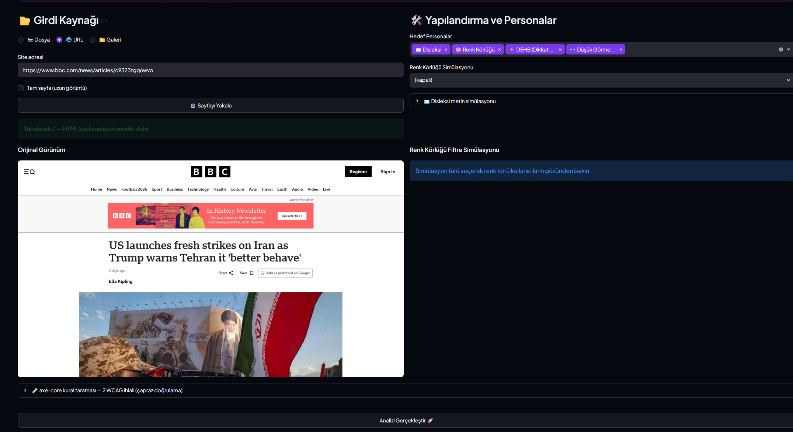
  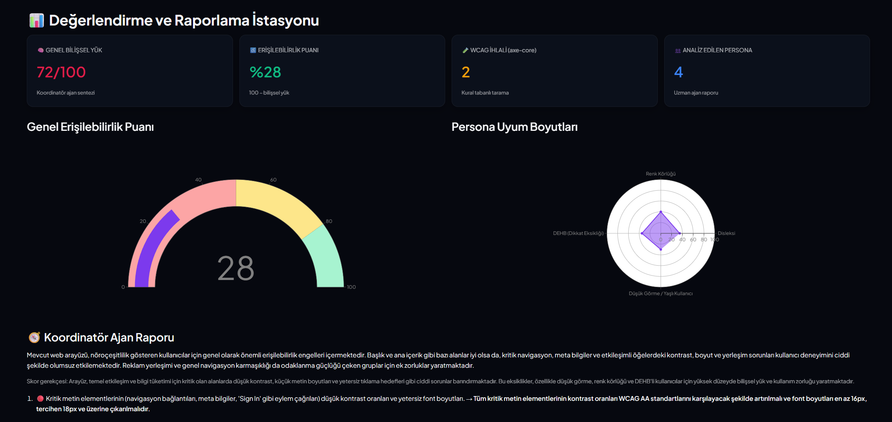
  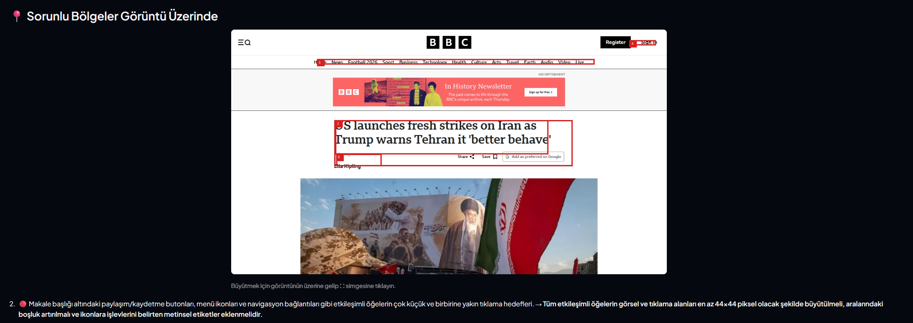
  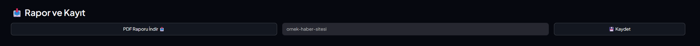

- **Sprint Review**:
Alınan kararlar: Koordinatör ajan sisteme entegre edilmiş; 4 personanın bulgularını sentezleyerek genel skor ve eylem planı üretmesi sağlanmıştır. URL modu devreye alınarak otomatik ekran görüntüsü ve HTML alımı aktifleştirilmiş, manuel yükleme ihtiyacı bitmiştir. axe-core WCAG taraması entegre edilerek LLM bulguları kural motoruyla doğrulanmaya başlanmıştır. Hatalı bölgeleri kırmızı kutularla işaretleme, disleksi metin simülasyonu ve renk körlüğü filtreleri tamamlanmıştır. Örnek galerisi, dashboard, logo tasarımı ve "Değerlendirme İstasyonu" arayüzü bitirilmiştir. 19 birim testi eklenmiş ve plandan önce PDF raporu oluşturma (4.3) tamamlanmıştır. Gelecek vizyonu için ses desteği, geri bildirim formu ve Chrome eklentisi fikirleri backlog'a eklenmiştir. Canlıya alma (4.7), tanıtım videosu, önce/sonra analizi ve ortak hafıza Sprint 3'e aktarılmıştır. Sprint Review katılımcıları: Gökhan Dumlupınar, Tuana Hergüner, M.Buğrahan Bayrakçı, Mustafa Yazbahar, Şükran Akşimşek

- **Sprint Review**:
Alınan kararlar: Koordinatör ajan sisteme entegre edilmiş; 4 personanın bulgularını sentezleyerek genel skor ve eylem planı üretmesi sağlanmıştır. URL modu devreye alınarak otomatik ekran görüntüsü ve HTML alımı aktifleştirilmiş, manuel yükleme ihtiyacı bitmiştir. axe-core WCAG taraması entegre edilerek LLM bulguları kural motoruyla doğrulanmaya başlanmıştır. Hatalı bölgeleri kırmızı kutularla işaretleme, disleksi metin simülasyonu ve renk körlüğü filtreleri tamamlanmıştır. Örnek galerisi, dashboard, logo tasarımı ve "Değerlendirme İstasyonu" arayüzü bitirilmiştir. 19 birim testi eklenmiş ve plandan önce PDF raporu oluşturma (4.3) tamamlanmıştır. Gelecek vizyonu için ses desteği, geri bildirim formu ve Chrome eklentisi fikirleri eklenmiştir. Canlıya alma (4.7), tanıtım videosu, önce/sonra analizi ve ortak hafıza Sprint 3'e aktarılmıştır. Sprint Review katılımcıları: Gökhan Dumlupınar, Tuana Hergüner, M.Buğrahan Bayrakçı, Mustafa Yazbahar, Şükran Akşimşek

- **Sprint Retrospective:**
  - axe-core ve LLM çapraz doğrulaması güven artırıcı bulunmuş, hibrit mimariye devam edilmesi kararlaştırılmıştır.
  - PDF raporunun erken bitmesi motivasyonu artırmış, benzer proaktif yaklaşımların sürdürülmesi hedeflenmiştir.
  - Birim testlerinin sona yığılması iş yükünü artırdığından, Sprint 3'te testlerin eş zamanlı yazılmasına karar verilmiştir.

  - Deploy adımının ilk güne bırakılması isabetli bulunmuş, olası entegrasyon risklerine karşı ilk gün tam kadro teknik senkronizasyon yapılması planlanmıştır.
  - Sunum, video ve deploy yoğunluğu nedeniyle Sprint 3 görev dağılımının çok daha keskin hatlarla yapılmasına karar verilmiştir.

  - Deploy adımının ilk güne bırakılması isabetli bulunmuş, olası entegrasyon risklerine karşı ilk gün tam kadro teknik senkronizasyon     yapılması planlanmıştır.
  - Sunum, video ve deploy yoğunluğu nedeniyle Sprint 3 görev dağılımının çok daha keskin hatlarla yapılması kararlaştırılmıştır.

---

# Sprint 3

---
