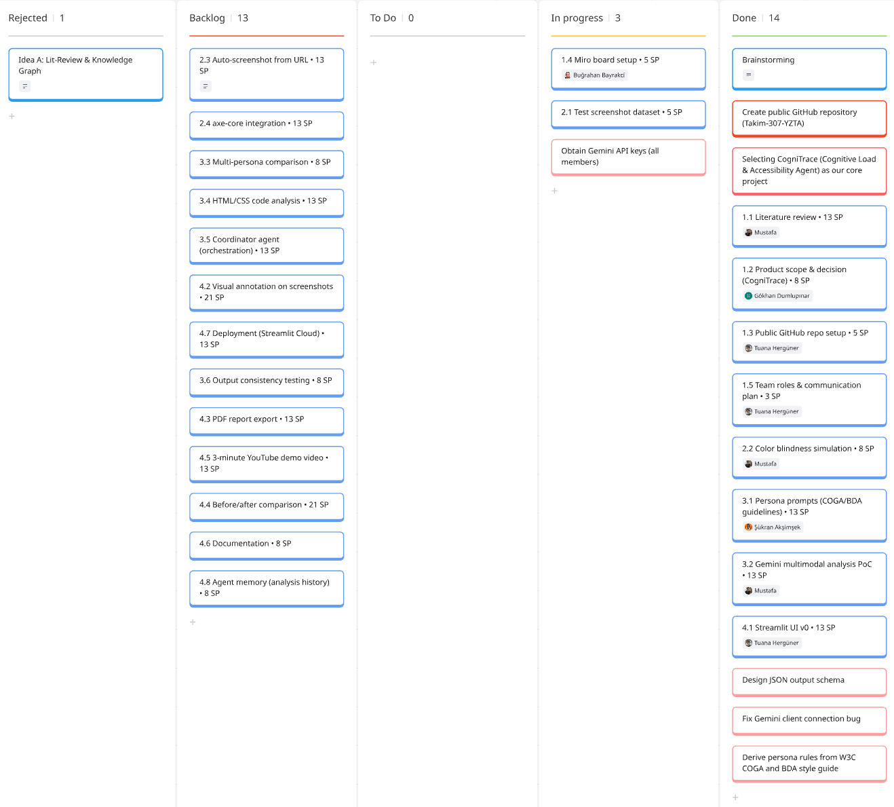
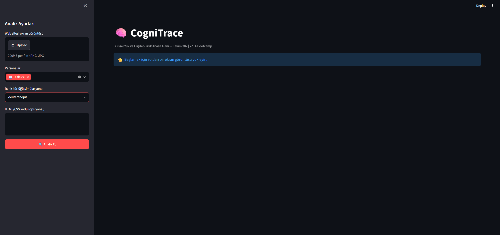

# Takım İsmi

**Takım 307**

# Ürün İle İlgili Bilgiler

## Takım Elemanları

| İsim | Ünvan | Sosyal Medya |
|---|---|---|
| [İSİM 1] | Product Owner | [LinkedIn] |
| [İSİM 2] | Scrum Master | [LinkedIn] |
| Mustafa YAZBAHAR | Developer | [LinkedIn] |
| M.Buğrahan BAYRAKCİ | Developer | [LinkedIn] |
| [İSİM 5] | Developer | [LinkedIn] |

## Ürün İsmi

**EmpatiLens** — Bilişsel Yük ve Erişilebilirlik Analiz Ajanı

*(Alternatif isim önerileri: NöroGöz, ErişimAI, KolayEkran — takımca oylayıp seçin)*

## Ürün Açıklaması

EmpatiLens, web sitelerinin ekran görüntülerini ve/veya HTML-CSS kodlarını alarak, arayüzü **nöroçeşitlilik personaları** (disleksi, renk körlüğü, DEHB, düşük görme) gözünden analiz eden multimodal bir yapay zekâ ajanıdır.

Geleneksel erişilebilirlik araçları (axe, WAVE, Lighthouse) yalnızca teknik WCAG kural ihlallerini tarar ve sorunların %30-57'sini yakalayabilir; hiçbiri arayüzün kullanıcıya bindirdiği **bilişsel yükü** ölçmez. EmpatiLens bu boşluğu doldurur:

1. Ekran görüntüsü deterministik ön işlemeden geçer (renk körlüğü simülasyonu, görsel karmaşıklık metrikleri).
2. Her nöroçeşitlilik personası için ayrı bir LLM ajanı, görüntüyü o kullanıcının gözünden analiz eder: *"Disleksili bir birey bu sayfada nereyi anlamakta zorlanır?"*
3. Koordinatör ajan, bulguları birleştirip 1-100 arası **Bilişsel Yük Skoru**, sorunlu bölge listesi ve önceliklendirilmiş iyileştirme önerileri içeren bir rapor üretir.

Böylece tasarımcılar ve geliştiriciler, gerçek kullanıcı testine erişimlerinin olmadığı durumlarda bile arayüzlerinin nöroçeşitli bireyler için ne kadar kapsayıcı olduğunu saniyeler içinde görebilir.

## Ürün Özellikleri

- 📸 **Ekran görüntüsü analizi:** PNG/JPG yükle, saniyeler içinde analiz al
- 🧠 **Persona bazlı ajan analizi:** Disleksi, renk körlüğü (deuteranopia/protanopia/tritanopia), DEHB ve düşük görme personaları
- 🎨 **Renk körlüğü simülasyonu:** Arayüzün renk körü bir kullanıcıya nasıl göründüğünü bilimsel matris dönüşümüyle gösterir
- 📊 **Bilişsel Yük Skoru (1-100):** Persona bazlı ve genel skor
- 📝 **Eyleme dönük öneriler:** W3C COGA ve British Dyslexia Association rehberlerine dayalı somut iyileştirme adımları
- 💻 **HTML/CSS kod analizi:** Görüntüye ek olarak kaynak kod üzerinden yapısal sorun tespiti
- 📄 **Rapor çıktısı:** Paylaşılabilir analiz raporu (Sprint 3: PDF dışa aktarım)

## Hedef Kitle

- Front-end geliştiriciler ve UI/UX tasarımcıları
- Erişilebilirlik uyumluluğu sağlamak zorunda olan kurumlar (kamu kurumları, bankalar, e-ticaret)
- Kullanıcı testi bütçesi olmayan girişimler ve öğrenci projeleri
- Erişilebilirlik danışmanları ve eğitimcileri

## Product Backlog URL

[Miro Backlog Board](https://miro.com/welcomeonboard/ZnVNcVprNUswTGFRL2o2bFZEZitRRndwSk01cCt1cU51UXZtT1IvUGhwQ0hyZkI4NnJWUDFNRlJId29XUXZIZGlKUksyRmMvaHFNWGppNFJ0OG5uejhYd3puT2J0aGVzQjh1ZFdMRzI1K0U1SjVvc1p2Q2ExK0N2NVRCS3JoeEV0R2lncW1vRmFBVnlLcVJzTmdFdlNRPT0hdjE=?share_link_id=307523071904)

---

# Sprint 1 (19 Haziran – 5 Temmuz 2026)

- **Sprint Notları:** User story'ler product backlog'ların içine yazılmıştır. Backlog item'lara tıklandığında hikâyelerin detayları okunabilir. Sprint 1'in odağı: fikrin netleştirilmesi, literatür taraması, proje altyapısının kurulması ve tek persona ile çalışan dikey dilim (vertical slice) prototip.

- **Sprint içinde tamamlanması tahmin edilen puan:** 90 Puan

- **Puan tamamlama mantığı:** Proje boyunca tamamlanması gereken toplam backlog puanı 300'dür. İlk sprint ağırlıklı olarak araştırma, kurulum ve temel prototip içerdiğinden 90 puan; Sprint 2'de çekirdek özellik geliştirme (110 puan); Sprint 3'te tamamlama, test ve sunum (100 puan) hedeflenmiştir.

- **Backlog düzeni ve Story seçimleri:** Backlog, Miro board üzerinde 4 epic altında düzenlenmiştir (Araştırma & Planlama, Veri & Ön İşleme, AI Ajan Geliştirme, Arayüz & Rapor). Her story karta story point yazılmıştır; kişi bazlı renk etiketleri kullanılmaktadır. Story'ler bir sprintte tamamlanabilecek büyüklükte task'lara bölünmüştür. Detay: `backlog/product-backlog.md`

- **Daily Scrum:** Daily Scrum toplantıları [WhatsApp/Slack] üzerinden her akşam [SAAT]'te yazılı olarak yapılmaktadır. Konuşma kayıtları ve örnek ekran görüntüleri: `ProjectManagement/Sprint1Documents/DailyScrumMeetingNotesSprint1.docx`

- **Sprint Board Update:** Sprint board ekran görüntüleri:
  
  *(Miro board ekran görüntülerini bu klasöre ekleyin: backlog1.png, backlog2.png ...)*

- **Ürün Durumu — Ekran Görüntüleri:**
  
  *(Streamlit prototipinin ekran görüntülerini ekleyin: productss1.png, productss2.png ...)*

- **Sprint Review:**
  - Literatür taraması tamamlandı; benzer akademik çalışmalar (UXAgent, AXNav) incelendi, birebir rakip ürün olmadığı doğrulandı → özgünlük iddiası güçlendi.
  - Ürün ismi ve persona seti (disleksi, renk körlüğü, DEHB, düşük görme) kararlaştırıldı.
  - Gemini 2.5 Flash (ücretsiz katman) ile tek görüntü + tek persona analizi yapan prototip çalışır durumda.
  - Renk körlüğü simülasyon modülü tamamlandı.
  - Sprint Review katılımcıları: [İSİMLER]

- **Sprint Retrospective:**
  - [Takımca doldurun — örnek maddeler:]
  - Daily scrum saatine uyum konusunda [karar].
  - API anahtarı herkes tarafından ayrı alınacak (kota riski).
  - Sprint 2'de görev dağılımı: [kim hangi epic].

---

# Sprint 2 (6 – 19 Temmuz 2026)

*(Sprint 2 sonunda doldurulacak — odak: AI agent orkestrasyonu, koordinatör ajan, axe-core entegrasyonu, URL'den otomatik screenshot, erken deploy)*

---

# Sprint 3 (20 Temmuz – 2 Ağustos 2026)

*(Sprint 3 sonunda doldurulacak — odak: PDF rapor, ajan hafızası, tutarlılık testleri, 3 dakikalık YouTube tanıtım videosu, ürün teslimi)*

> ⏰ **Teslim hatırlatmaları (Bursiyer Kılavuzu):** Ürün teslimi **2 Ağustos Pazar 23.59'a kadar** Scrum Master tarafından Ürün Teslim Formu üzerinden yapılacak. 3 dakikalık proje videosu YouTube'a yüklenecek. Repo public kalmalı. Top 10 sunumu: 14 Ağustos.
