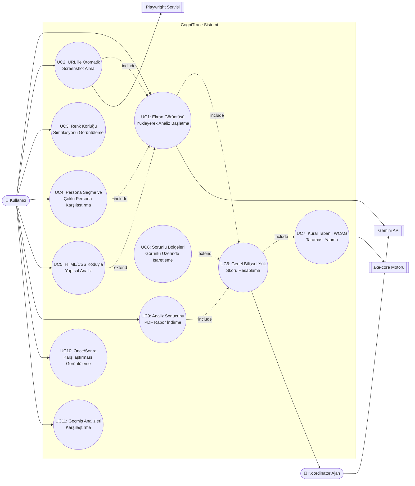

# Use Case Analizi — CogniTrace

> Bu doküman, CogniTrace uygulamasının fonksiyonel kapsamını use case (kullanım senaryosu) yöntemiyle tanımlar. Sprint 1'de tamamlanan use case'ler ile Sprint 2-3'te geliştirilecek use case'ler ayrı ayrı işaretlenmiştir. Kaynak: [backlog/product-backlog.md](../backlog/product-backlog.md), [README.md](../README.md).

## 1. Amaç ve Kapsam

CogniTrace, bir web sayfasının ekran görüntüsünü (veya URL'sini) ve isteğe bağlı kaynak kodunu girdi olarak alıp, seçilen nöroçeşitlilik personaları (disleksi, renk körlüğü, DEHB, düşük görme) gözünden bilişsel yük ve erişilebilirlik analizi üreten bir sistemdir. Bu doküman sistemin dış aktörlerle olan tüm etkileşimlerini use case olarak tanımlar.

**Kapsam içi**: Görüntü/URL girişi, persona seçimi, AI tabanlı analiz üretimi, kural tabanlı (axe-core) analiz, sonuçların görselleştirilmesi ve raporlanması.
**Kapsam dışı**: Kullanıcı hesap/kimlik doğrulama sistemi, çoklu kullanıcılı takım yönetimi, ödeme/abonelik akışları (bu bootcamp ürününde planlanmamıştır).

## 2. Aktörler

| Aktör | Tip | Açıklama |
|---|---|---|
| **Kullanıcı** | Birincil (insan) | Web tasarımcısı, ön yüz geliştirici veya erişilebilirlik denetçisi. Uygulamayı tarayıcıdan kullanır. |
| **Persona Analiz Ajanı** | Dahili sistem aktörü | Her persona (disleksi, renk körlüğü, DEHB, düşük görme) için ayrı çalışan, Gemini'yi belirli bir uzmanlık promptuyla çağıran alt ajan. |
| **Koordinatör Ajan** | Dahili sistem aktörü | Persona ajanlarının çıktısını birleştirip genel bilişsel yük skorunu ve konsolide raporu üreten orkestrasyon katmanı (Sprint 2). |
| **Gemini API** | Harici sistem | Google'ın multimodal LLM servisi; görüntü + prompt alıp yapılandırılmış JSON analiz döndürür. |
| **Playwright Servisi** | Harici sistem | Verilen URL'den otomatik ekran görüntüsü alan tarayıcı otomasyon motoru (Sprint 2). |
| **axe-core Motoru** | Harici sistem | Kural tabanlı WCAG uyumluluk taraması yapan açık kaynak kütüphane (Sprint 2). |

## 3. Use Case Diyagramı

> Not: Mermaid'de standart bir "use case diyagramı" tipi bulunmadığından yukarıdaki gösterim `flowchart` sözdizimiyle UML use case diyagramını yaklaşık olarak temsil eder. Noktalı oklar (`-.->`) `include`/`extend` ilişkilerini gösterir.

## 4. Use Case Listesi ve Önceliklendirme

| ID | Ad | İlgili Backlog Story | Sprint | Durum |
|---|---|---|---|---|
| UC1 | Ekran Görüntüsü Yükleyerek Analiz Başlatma | 3.2, 4.1 | 1 | ✅ Tamamlandı |
| UC3 | Renk Körlüğü Simülasyonu Görüntüleme | 2.2 | 1 | ✅ Tamamlandı |
| UC4 | Persona Seçme ve Çoklu Persona Karşılaştırmalı Analiz | 3.1, 3.3 | 1 / 2 | 🟡 Kısmen (tekli persona ✅, çoklu karşılaştırma 🔲) |
| UC2 | URL ile Otomatik Screenshot Alma | 2.3 | 2 | 🔲 Planlandı |
| UC5 | HTML/CSS Koduyla Yapısal Analiz | 3.4 | 2 | 🔲 Planlandı |
| UC6 | Genel Bilişsel Yük Skoru Hesaplama (Koordinatör Ajan) | 3.5 | 2 | 🟡 Geçici mantıkla var (ortalama), gerçek orkestrasyon 🔲 |
| UC7 | Kural Tabanlı WCAG Taraması Yapma | 2.4 | 2 | 🔲 Planlandı |
| UC8 | Sorunlu Bölgeleri Görüntü Üzerinde İşaretleme | 4.2 | 2 | 🔲 Planlandı |
| UC9 | Analiz Sonucunu PDF Rapor Olarak İndirme | 4.3 | 3 | 🔲 Planlandı |
| UC10 | Önce/Sonra Karşılaştırması Görüntüleme | 4.4 | 3 | 🔲 Planlandı |
| UC11 | Geçmiş Analizleri Karşılaştırma (Ajan Hafızası) | 4.8 | 3 | 🔲 Planlandı |

---

## 5. Ayrıntılı Use Case Açıklamaları

### UC1 — Ekran Görüntüsü Yükleyerek Analiz Başlatma

| Alan | Açıklama |
|---|---|
| **Aktörler** | Kullanıcı (birincil), Persona Analiz Ajanı, Gemini API |
| **Tetikleyici** | Kullanıcı arayüze bir ekran görüntüsü dosyası yükler ve "Analiz Et" butonuna basar. |
| **Ön Koşullar** | - Kullanıcı uygulamaya erişebiliyor (Streamlit çalışıyor). - Geçerli bir `GEMINI_API_KEY` `.env` dosyasında tanımlı. - En az bir persona seçilmiş. |
| **Son Koşullar (Başarı)** | Seçilen her persona için bilişsel yük skoru, sorunlu alanlar, öneriler ve pozitif yönler ekranda listelenir. |
| **Son Koşullar (Başarısızlık)** | Kullanıcıya hata mesajı gösterilir, önceki analiz sonuçları (varsa) korunur. |

**Ana Akış:**
1. Kullanıcı kenar çubuğundan PNG/JPG formatında bir ekran görüntüsü seçer.
2. Sistem görüntüyü belleğe yükler ve "Orijinal" başlığı altında önizler.
3. Kullanıcı en az bir persona seçer (varsayılan: "disleksi").
4. Kullanıcı "🔍 Analiz Et" butonuna basar.
5. Sistem, seçilen her persona için sırayla Persona Analiz Ajanı'nı tetikler.
6. Persona Analiz Ajanı, görüntü baytlarını ve persona'ya özgü uzmanlık promptunu birlikte Gemini API'ye gönderir (`analyzer.analiz_et`).
7. Gemini API, önceden tanımlı JSON şemasına uygun bir analiz döndürür (`bilissel_yuk_skoru`, `genel_degerlendirme`, `sorunlu_alanlar`, `oneriler`, `pozitif_yonler`).
8. Sistem her persona sonucunu ayrı bir bölümde (skor metriği, sorunlu alan listesi, öneri listesi, pozitif yönler açılır paneli) gösterir.
9. Tüm personalar tamamlandıktan sonra sistem genel bir skor hesaplayıp gösterir (bkz. UC6).

**Alternatif Akışlar:**
- **3a. Hiç persona seçilmemiş:** Sistem "En az bir persona seçin." uyarısı gösterir ve akış durur.
- **6a. `GEMINI_API_KEY` tanımsız:** Sistem `RuntimeError` fırlatır, kullanıcıya anahtarı `.env` dosyasına eklemesi gerektiği bildirilir.
- **7a. Gemini API kota/429 hatası döndürür:** İlgili persona için hata mesajı gösterilir, diğer personaların analizi kesintisiz devam eder (`app.py` her personayı `try/except` içinde işler).
- **7b. Model JSON şemasına uymayan bir yanıt döndürür:** `json.loads` hata fırlatır, kullanıcıya "Analiz Et"e tekrar basması önerilir.

**İş Kuralları:**
- Skor 1-100 arasında bir tamsayıdır; 1 = çok rahat, 100 = aşırı yorucu.
- Her persona analizi bağımsızdır; bir personanın hatası diğerlerini engellemez.
- Model çıktısı yalnızca görüntüde gözlemlenen kanıtlara dayanmalı, varsayımsal sorun üretmemelidir (prompt seviyesinde zorunlu kılınır).

---

### UC2 — URL ile Otomatik Screenshot Alma *(Sprint 2)*

| Alan | Açıklama |
|---|---|
| **Aktörler** | Kullanıcı (birincil), Playwright Servisi |
| **Tetikleyici** | Kullanıcı, dosya yüklemek yerine bir web sitesi URL'si girer. |
| **Ön Koşullar** | Girilen URL herkese açık ve erişilebilir olmalı (kimlik doğrulama arkasında olmayan sayfalar). |
| **Son Koşullar (Başarı)** | Sayfanın ekran görüntüsü otomatik alınır ve UC1'in 2. adımından itibaren akışa dahil edilir (`include` ilişkisi). |
| **Son Koşullar (Başarısızlık)** | Kullanıcıya "sayfa yüklenemedi / zaman aşımı" hatası gösterilir. |

**Ana Akış:**
1. Kullanıcı arayüzde dosya yükleme yerine "URL ile analiz et" seçeneğini seçer.
2. Kullanıcı geçerli bir URL girer (örn. `https://example.com`).
3. Sistem, Playwright Servisi'ni tetikleyerek headless tarayıcıda sayfayı açar.
4. Playwright, sayfa tam yüklendikten sonra tam sayfa (full-page) ekran görüntüsü alır.
5. Alınan görüntü, UC1'deki "yüklenen dosya" ile aynı şekilde işlenmeye devam eder (UC1'i `include` eder).

**Alternatif Akışlar:**
- **2a. Geçersiz/biçimsiz URL:** Sistem istemci tarafında doğrulama hatası gösterir, isteği Playwright'a göndermez.
- **3a. Sayfa zaman aşımına uğrar (örn. 15 saniye):** Sistem "Sayfa yüklenemedi, URL'yi kontrol edin" hatası döndürür.
- **3b. Sayfa bot/otomasyon engelleme mekanizması içeriyor:** Kullanıcıya manuel ekran görüntüsü yükleme (UC1) alternatif olarak önerilir.

**İş Kuralları:**
- Alınan görüntü, dosya yükleme akışıyla aynı boyut/format kısıtlarına tabidir.
- Playwright servisi zaman aşımı süresi, kullanıcı deneyimini bozmamak için makul bir üst sınırda tutulmalıdır (örn. 15-20 sn).

---

### UC3 — Renk Körlüğü Simülasyonu Görüntüleme

| Alan | Açıklama |
|---|---|
| **Aktörler** | Kullanıcı |
| **Tetikleyici** | Kullanıcı, kenar çubuğundaki simülasyon tipi seçicisinden bir tip seçer (deuteranopia / protanopia / tritanopia). |
| **Ön Koşullar** | Bir görüntü zaten yüklenmiş olmalı. |
| **Son Koşullar (Başarı)** | Seçilen görüntünün renk körlüğü simülasyonlu hali, orijinalin yanında gösterilir. |

**Ana Akış:**
1. Kullanıcı bir görüntü yükler (UC1'in ilk adımları).
2. Kullanıcı "Renk körlüğü simülasyonu" açılır listesinden bir tip seçer.
3. Sistem, seçilen tipe karşılık gelen dönüşüm matrisini (`simulation.DONUSUM_MATRISLERI`) uygular.
4. Simülasyon sonucu, orijinal görüntünün sağında ayrı bir sütunda gösterilir.

**Alternatif Akışlar:**
- **2a. Kullanıcı "(kapalı)" seçeneğini seçer:** Simülasyon paneli gösterilmez, yalnızca orijinal görüntü görünür (varsayılan durum).

**İş Kuralları:**
- Simülasyon tamamen deterministik matris işlemleriyle yapılır; LLM çağrısı gerektirmez (maliyetsiz, anlık).

---

### UC4 — Persona Seçme ve Çoklu Persona Karşılaştırmalı Analiz

| Alan | Açıklama |
|---|---|
| **Aktörler** | Kullanıcı, Persona Analiz Ajanı (çoklu örnek) |
| **Tetikleyici** | Kullanıcı birden fazla persona seçip analiz başlatır. |
| **Ön Koşullar** | Bir görüntü yüklenmiş olmalı (UC1 ile `include` ilişkisi). |
| **Son Koşullar (Başarı)** | Seçilen tüm personaların sonuçları yan yana/karşılaştırmalı biçimde gösterilir; hangi personanın hangi konuda daha kritik olduğu görülebilir. |

**Ana Akış (Sprint 1 — tekli persona, mevcut):**
1. Kullanıcı `PERSONAS` listesinden bir veya daha fazla persona seçer (disleksi, renk körlüğü, DEHB, düşük görme).
2. Sistem her personayı sırayla işler (UC1 adım 5-8).
3. Sonuçlar sayfada alt alta, her biri kendi başlığı altında gösterilir.

**Genişletilmiş Akış (Sprint 2 — karşılaştırmalı görünüm, planlanan):**
4. Sistem, iki veya daha fazla persona seçildiğinde otomatik olarak "Karşılaştırma" görünümüne geçer: personaların skorları yan yana bir bar/tablo halinde gösterilir.
5. Kullanıcı, hangi sorunun kaç persona tarafından ortak olarak işaretlendiğini (örn. "düşük kontrast" hem renk körlüğü hem düşük görme personası tarafından bulundu) görebilir.

**Alternatif Akışlar:**
- **1a. Hiç persona seçilmez:** UC1'deki "En az bir persona seçin" uyarısı tetiklenir.
- **4a. Yalnızca tek persona seçilmişse:** Karşılaştırma görünümü atlanır, doğrudan UC1'deki tekli gösterim kullanılır.

**İş Kuralları:**
- Persona sayısı arttıkça toplam Gemini API çağrı sayısı da artar (her persona = 1 çağrı); kota tüketimi kullanıcıya arayüzde belirtilmelidir.

---

### UC5 — HTML/CSS Koduyla Yapısal Analiz *(Sprint 2)*

| Alan | Açıklama |
|---|---|
| **Aktörler** | Kullanıcı, Persona Analiz Ajanı, Gemini API |
| **Tetikleyici** | Kullanıcı, görüntüyle birlikte sayfanın HTML/CSS kaynak kodunu da yapıştırır. |
| **Ön Koşullar** | Bir görüntü yüklenmiş olmalı; HTML alanı doldurulmuş olmalı (bu use case UC1'i `extend` eder — opsiyonel ek girdi). |
| **Son Koşullar (Başarı)** | Analiz sonucu, yalnızca görsel değil yapısal/kodsal sorunları da içerir (örn. eksik `alt` metni, tanımsız font-family, satır uzunluğu CSS'te sınırlanmamış). |

**Ana Akış:**
1. Kullanıcı kenar çubuğundaki "HTML/CSS kodu" alanına sayfa kaynağını yapıştırır.
2. Kullanıcı "Analiz Et"e basar (UC1 akışıyla birleşir).
3. Sistem, görüntü baytlarına ek olarak HTML kodunu (ilk 20.000 karakterle sınırlı) Gemini API isteğine ekler (`analyzer.analiz_et` — `html_kodu` parametresi).
4. Gemini API, hem görsel hem yapısal bulguları aynı JSON şemasında döndürür.
5. Sistem sonuçları UC1 ile aynı biçimde gösterir; yapısal bulgular `sorunlu_alanlar` içinde ayırt edilebilir şekilde işaretlenir (planlanan geliştirme: bulgu kaynağı etiketi — "görsel" / "kod").

**Alternatif Akışlar:**
- **1a. HTML alanı boş bırakılır:** Sistem yalnızca görsel analiz yapar (UC1'in standart akışı, geriye dönük uyumlu).
- **3a. HTML kodu 20.000 karakteri aşar:** Sistem kodu kırpar, kullanıcıya kırpıldığı bilgisi verilmez (mevcut davranış) — **iyileştirme adayı**: kullanıcıya kırpma uyarısı gösterilmeli.

**İş Kuralları:**
- HTML girişi tamamen opsiyoneldir; sistem hem görüntü-only hem görüntü+kod modunda çalışabilmelidir.
- Token/maliyet kontrolü için kaynak kodu üst sınırla kırpılır.

---

### UC6 — Genel Bilişsel Yük Skoru Hesaplama (Koordinatör Ajan Orkestrasyonu) *(Sprint 2 — kritik puanlama kriteri)*

| Alan | Açıklama |
|---|---|
| **Aktörler** | Koordinatör Ajan, Persona Analiz Ajanı (çoklu), Gemini API |
| **Tetikleyici** | UC1/UC4 akışında tüm seçilen personaların analizi tamamlandığında otomatik olarak devreye girer. |
| **Ön Koşullar** | En az bir persona analizi başarıyla tamamlanmış olmalı. |
| **Son Koşullar (Başarı)** | Tek, konsolide bir "Genel Bilişsel Yük Skoru" ve ortak/çelişen bulguların özetlendiği bir üst rapor üretilir. |

**Ana Akış (Sprint 1 — mevcut geçici mantık):**
1. Sistem, tamamlanan her personanın `bilissel_yuk_skoru` değerini bir listede toplar.
2. Sistem, listenin aritmetik ortalamasını alıp "🎯 Genel Bilişsel Yük Skoru" olarak gösterir (`app.py:97-102`).

**Hedeflenen Akış (Sprint 2 — gerçek koordinatör ajan):**
1. Koordinatör Ajan, tüm persona ajanlarının ham JSON çıktılarını (skor + sorunlu alanlar + öneriler) toplar.
2. Koordinatör Ajan, sorunlu alanları çapraz karşılaştırır: birden fazla persona tarafından işaretlenen ortak sorunları "yüksek öncelik" olarak yeniden sınıflandırır.
3. Koordinatör Ajan, basit ortalama yerine ağırlıklı bir puanlama uygular (örn. yüksek önemli ortak sorunlar skoru daha çok etkiler).
4. Koordinatör Ajan, konsolide bir "genel değerlendirme" metni ve öncelik sıralı bir öneri listesi üretir.
5. Sistem, hem persona bazlı detay hem de koordinatörün konsolide görünümünü kullanıcıya sunar.

**Alternatif Akışlar:**
- **1a. Yalnızca bir persona seçilmişse:** Koordinatör devreye girmez, o personanın skoru doğrudan genel skor olarak gösterilir.
- **2a. Hiçbir persona sorunlu alan bulmamışsa:** Koordinatör "düşük bilişsel yük, önemli sorun tespit edilmedi" özetini üretir.

**İş Kuralları:**
- Bu use case, bootcamp değerlendirme kriterlerindeki "AI Agent kullanımı, hafıza, orkestrasyon" maddesiyle doğrudan ilişkilidir; skor hesaplamasının yalnızca kozmetik değil, gerçek bir birleştirme mantığı içermesi beklenir.

---

### UC7 — Kural Tabanlı WCAG Taraması Yapma *(Sprint 2)*

| Alan | Açıklama |
|---|---|
| **Aktörler** | Koordinatör Ajan, axe-core Motoru |
| **Tetikleyici** | Analiz sürecinde (UC1/UC2), sayfa HTML'i mevcutsa otomatik tetiklenir. |
| **Ön Koşullar** | Sayfanın DOM/HTML içeriğine erişim olmalı (URL'den alınmış veya kullanıcı tarafından yapıştırılmış). |
| **Son Koşullar (Başarı)** | axe-core'un ürettiği kural tabanlı ihlal listesi (örn. eksik `alt`, düşük kontrast oranı, eksik `label`) LLM analiziyle birlikte sunulur. |

**Ana Akış:**
1. Sistem, mevcut HTML/DOM içeriği üzerinde axe-core motorunu çalıştırır.
2. axe-core, WCAG 2.2 kurallarına göre otomatik tespit edilebilir ihlalleri (kural ID, etkilenen element, önem derecesi) döndürür.
3. Koordinatör Ajan, axe-core sonuçlarını LLM tabanlı persona analizleriyle birleştirir: axe-core'un kesin tespit ettiği ihlaller "doğrulanmış" olarak işaretlenir, LLM'in öznel gözlemleri ayrı tutulur.
4. Sistem, birleşik raporu kullanıcıya gösterir.

**Alternatif Akışlar:**
- **1a. HTML/DOM erişimi yok (yalnızca statik görüntü yüklenmiş):** axe-core adımı atlanır, yalnızca LLM tabanlı analiz gösterilir.

**İş Kuralları:**
- axe-core bulguları "kural tabanlı / kesin" olarak, LLM bulguları "yorumsal / olası" olarak etiketlenmelidir — kullanıcı güven düzeyini ayırt edebilmelidir.

---

### UC8 — Sorunlu Bölgeleri Görüntü Üzerinde İşaretleme *(Sprint 2)*

| Alan | Açıklama |
|---|---|
| **Aktörler** | Kullanıcı |
| **Tetikleyici** | UC6 tamamlandıktan sonra, kullanıcı sonuç görüntüsünü inceler. |
| **Ön Koşullar** | En az bir `sorunlu_alanlar` girdisi mevcut olmalı. |
| **Son Koşullar (Başarı)** | Orijinal görüntü üzerinde, her sorunlu bölge için bir bounding box (dikdörtgen) ve önem derecesine göre renklendirilmiş etiket çizilir. |

**Ana Akış:**
1. Sistem, her `sorunlu_alanlar` girdisindeki metinsel konum tarifini (örn. "sağ üst köşedeki menü") görüntü koordinatlarına eşler (LLM'den doğrudan koordinat istenmesi veya ikinci bir görüntü-temellendirme çağrısı ile).
2. Sistem, eşlenen her bölge için görüntü üzerine bounding box çizer; renk önem derecesine göre belirlenir (🔴 yüksek, 🟡 orta, 🟢 düşük).
3. Kullanıcı, kutunun üzerine geldiğinde veya tıkladığında ilgili sorunun açıklamasını görür.

**Alternatif Akışlar:**
- **1a. Konum eşlemesi güven eşiğinin altında kalırsa:** Sistem o bölge için kutu çizmez, yalnızca metinsel açıklamayı listede bırakır (yanlış işaretlemeyi önlemek için).

**İş Kuralları:**
- Görsel işaretleme, metinsel bulguların yerini almaz; her zaman birlikte sunulur (erişilebilirlik: yalnızca renk/görselle bilgi iletilmemeli — sistemin kendi ürettiği rapor da aynı ilkeye uymalı).

---

### UC9 — Analiz Sonucunu PDF Rapor Olarak İndirme *(Sprint 3)*

| Alan | Açıklama |
|---|---|
| **Aktörler** | Kullanıcı |
| **Tetikleyici** | Kullanıcı, tamamlanmış bir analiz sonucunda "Raporu İndir" butonuna basar. |
| **Ön Koşullar** | En az bir persona analizi ve genel skor (UC6) hesaplanmış olmalı. |
| **Son Koşullar (Başarı)** | Kullanıcının tarayıcısına, analiz özetini, persona bazlı bulguları, önerileri ve (varsa) işaretlenmiş görüntüyü içeren bir PDF dosyası indirilir. |

**Ana Akış:**
1. Kullanıcı analiz tamamlandıktan sonra "📄 Raporu İndir" butonuna basar.
2. Sistem, mevcut analiz verilerinden (skor, persona sonuçları, öneriler, işaretli görüntü) bir PDF şablonu doldurur.
3. Sistem, oluşturulan PDF dosyasını kullanıcının tarayıcısı üzerinden indirmeye sunar.

**Alternatif Akışlar:**
- **2a. PDF oluşturma sırasında hata oluşursa:** Kullanıcıya hata mesajı gösterilir, analiz sonuçları ekranda kaybolmaz.

**İş Kuralları:**
- Rapor, kurum içi paylaşım için tasarlanır; marka/başlık alanı (CogniTrace logosu, tarih, analiz edilen URL/dosya adı) içermelidir.

---

### UC10 — Önce/Sonra Karşılaştırması Görüntüleme *(Sprint 3)*

| Alan | Açıklama |
|---|---|
| **Aktörler** | Kullanıcı, Gemini API |
| **Tetikleyici** | Kullanıcı, mevcut bir analiz sonucunda "Önerilen iyileştirmeleri göster" seçeneğini kullanır. |
| **Ön Koşullar** | UC1 tamamlanmış ve `oneriler` listesi dolu olmalı. |
| **Son Koşullar (Başarı)** | Kullanıcı, önerilen değişikliklerin uygulanmış halini gösteren bir "sonra" görüntüsünü (veya kod diff'ini) orijinalin yanında görür. |

**Ana Akış:**
1. Kullanıcı bir analiz sonucunda "Önce/Sonra karşılaştırması" butonuna basar.
2. Sistem, `oneriler` listesindeki önerileri temel alarak, mümkünse HTML/CSS düzeyinde bir düzeltme önerisi (kod yaması) veya görsel temsil üretir.
3. Sistem, orijinal ve iyileştirilmiş halleri yan yana gösterir.

**Alternatif Akışlar:**
- **2a. Yalnızca görüntü girildiyse (HTML yoksa):** Sistem kod yaması üretemez; bunun yerine yalnızca metinsel "böyle olmalı" açıklaması gösterir.

**İş Kuralları:**
- Üretilen "sonra" hali kesin bir garanti değil, bir öneri temsilidir; kullanıcıya bu netlikle belirtilmelidir.

---

### UC11 — Geçmiş Analizleri Karşılaştırma (Ajan Hafızası) *(Sprint 3 — kritik puanlama kriteri)*

| Alan | Açıklama |
|---|---|
| **Aktörler** | Kullanıcı, Koordinatör Ajan |
| **Tetikleyici** | Kullanıcı, aynı site/görüntü için daha önce yapılmış bir analizin üzerine yeni bir analiz çalıştırır. |
| **Ön Koşullar** | Sistemde en az bir önceki analiz kaydı (ajan hafızası) mevcut olmalı. |
| **Son Koşullar (Başarı)** | Kullanıcı, güncel skorun önceki analize göre iyileşip iyileşmediğini (trend) görür. |

**Ana Akış:**
1. Kullanıcı yeni bir analiz başlatır (UC1/UC6 tamamlanır).
2. Koordinatör Ajan, analiz sonucunu bir hafıza deposuna (örn. yerel dosya/DB, anahtar: URL veya görüntü hash'i) kaydeder.
3. Sistem, aynı anahtara ait önceki kayıt(lar) varsa, güncel skor ile önceki skoru karşılaştıran bir trend grafiği/özet gösterir.
4. Kullanıcı, "geçmiş analizler" panelinden tüm önceki çalıştırmaları listeleyip inceleyebilir.

**Alternatif Akışlar:**
- **2a. Aynı site/görüntü için ilk analiz:** Sistem hafızaya kaydeder ama karşılaştırma göstermez (baseline oluşturur).
- **4a. Kullanıcı geçmiş kaydı silmek isterse:** Sistem onay ister, onaylanırsa hafızadan kaldırır.

**İş Kuralları:**
- Hafıza, kullanıcı bazlı değil proje/oturum bazlı basit bir depo olabilir (bootcamp kapsamında çoklu kullanıcı kimlik doğrulaması yoktur).
- Bu use case, bootcamp değerlendirme kriterlerindeki "AI Agent kullanımı, hafıza, orkestrasyon" maddesiyle doğrudan ilişkilidir.

---

## 6. Genel İş Kuralları (Tüm Use Case'lere Uygulanan)

- Sistem yalnızca Türkçe yanıt üretir (prompt seviyesinde zorunlu kılınmıştır).
- Tüm AI çıktıları yapılandırılmış JSON şemasına uymak zorundadır; şema dışına çıkan yanıtlar hata olarak ele alınır, kullanıcıdan tekrar deneme istenir.
- Bir personanın/adımın başarısız olması, diğer personaların/adımların tamamlanmasını engellememelidir (kısmi başarı ilkesi).
- Gemini API çağrıları kota limitine tabidir; sistem 429 hatalarını kullanıcıya anlaşılır şekilde iletmelidir.

## 7. Kapsam Dışı Bırakılanlar

- Çoklu kullanıcı hesap yönetimi, rol tabanlı yetkilendirme.
- Gerçek zamanlı işbirliği (aynı analizi birden fazla kullanıcının eş zamanlı görüntülemesi).
- Ödeme/abonelik akışları.
- Mobil uygulama (yalnızca web/Streamlit arayüzü hedeflenmektedir).

